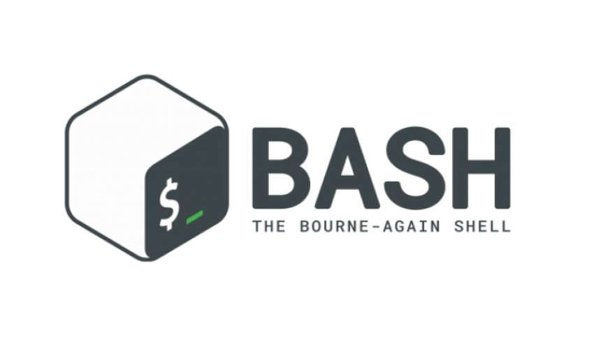

<h1 align="center">Welcome to Shell-Script 👋</h1>


<p align="center">
  
  <a href="Teste" target="_blank">
    
  </a>
  <a href="Teste" target="_blank">
    
  </a>
  
</p>

<p align="center">
  <a href="#how-to-use">How to Use</a>&nbsp;&nbsp;&nbsp;|&nbsp;&nbsp;&nbsp;
  <a href="#-technologies">Technologies</a>&nbsp;&nbsp;&nbsp;|&nbsp;&nbsp;&nbsp;
  <a href="#author">Author</a>&nbsp;&nbsp;&nbsp;|&nbsp;&nbsp;&nbsp;
  <a href="#-license">License</a>
</p>

# About 

> Here gonna be update some Script using Bash


# Table of Contents

| Projects  |     Links     | 
|:----------|:-------------:|
|Routines/MySQL | [Routines/MySQL](https://github.com/Wayfiding/Shell-Scripts/tree/main/Routines/MySQL) | 
|Routines/Servers | [Routines/Servers](https://github.com/Wayfiding/Shell-Scripts/tree/main/Routines/Servers) | 


## How to use

Choose a project and click, you will be redirect to the proper repository folder, there you will find another README explaining how to use the project and test on your Computer.


### **Pick just one folder**
If you want just one folder from this repository you can just click on the folder that you want or in Table of Content and there you gonna find a Readme explaining how to download just that folder. 

Or just follow this steps :

1. Click on the folder;
2. Copy the url from your browser;
3. Replace the 'tree/main' or 'tree/master' with trunk;

Example: 
> https://github.com/User/somerepo/tree/main/folderyouwant
 
> https://github.com/User/somerepo/trunk/folderyouwant 

4.Go to the command Line and just grab the folder with SVN

```sh
    svn checkout https://github.com/User/somerepo/trunk/folderyouwant 
```
## Technologies

On this repository you will find the following techonolgies been used.
- Bash
- Visual Studio Code
  

## Author

👤 **Alberto Junior**

* Github: [Alberto Júnior](https://github.com/wayfiding)
* LinkedIn: [Alberto Souza](https://linkedin.com/in/alberto-souza)

## 🤝 Contributing

Contributions, issues and feature requests are welcome!<br />Feel free to check [issues page](Teste). 

## Show your support

Give a ⭐️ if this project helped you!

## 📝 License
Copyright © 2021 [Alberto Júnior](https://github.com/Wayfiding).<br />

Esse projeto está sob a licença MIT. Veja o arquivo [LICENSE](.github/LICENSE.md) para mais detalhes.

***
_This README was generated with ❤️ by [readme-md-generator](https://github.com/kefranabg/readme-md-generator)_